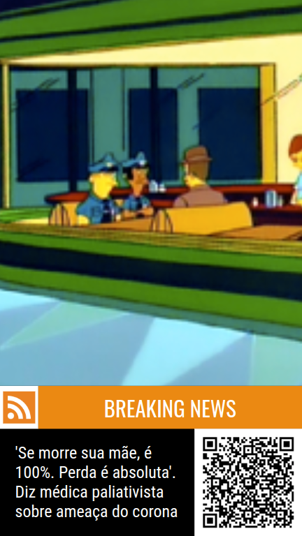

# DSPLAY - RSS

This is a HTML-based template for [DSPLAY](https://dsplay.tv).

## Basics

> This project was bootstrapped with [DSPLAY - React Template Boilerplate](https://github.com/dsplay/template-boilerplate-react).

## Support Screen Formats/Resolutions

This works for the following screen formats in any resolution:

- Landscape
  
- Portrait
  
- Square
  
- Horizontal Banner
  

### Configuration

This template has some configuration variables as the following table shows:

| Variable              | Type    | Default    | Description                                  |
|-----------------------|---------|------------| ---------------------------------------------|
| `show_qr_code`        | boolean | true       | enables/disables the QR Code                 |
| `bg_color`            | color   | black      | Background Color.                            |
| `logo`                | image   | none       | Logo Image                                   |
| `logo_bg_color`       | color   | white      | Logo Background Color                        |
| `title_color`         | color   | white      | Title Color                                  |
| `title_bg_color`      | color   | darkorange | Title Background Color                       |
| `text_color`          | color   | white      | Text Color                                   |
| `text_bg_color`       | color   | black      | Text Background Color                        |


## Customizing

### Getting started

```
git clone https://github.com/dsplay/template-rss.git my-awesome-template
cd my-awesome-template
rm -rf .git
npm i
npm start
```

## Packing (release build)

To create a release build of the template, ready to be uploaded to DSPLAY, just run:

```
npm run zip
```

It will generate a `template.zip` file ready to be deployed to [DSPLAY Web Manager](https://manager.dsplay.tv/template/create)

## More

The see more about DSPLAY HTML Templates, visit: https://developers.dsplay.tv/docs/html-templates
```
